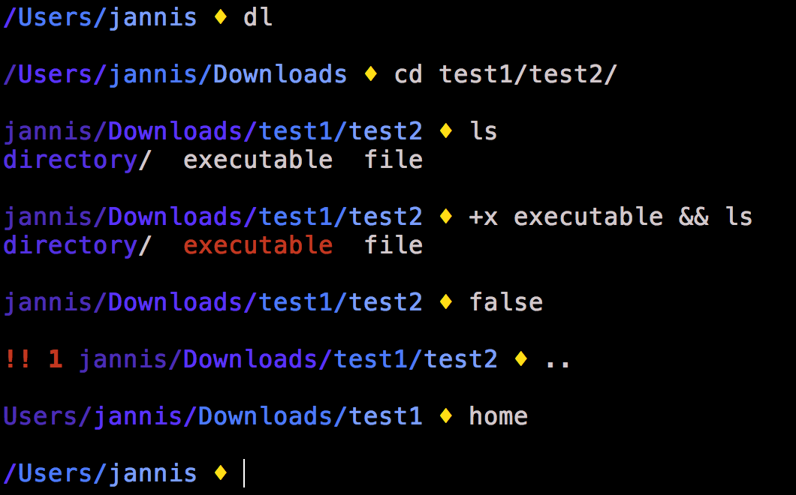

# dotfiles

Dotfiles help you personalize your system. These are mine.



The dotfiles are [MIT-licensed](LICENSE).


## Installing

When setting up a **new OS X system**, you may want to install [Homebrew](https://brew.sh/), [node.js](https://nodejs.org/) and [some tools](bootstrap.sh).

```bash
bash <(curl -s https://raw.githubusercontent.com/derhuerst/dotfiles/master/bootstrap.sh)
```

If you already did this or don't want to do it, install the **basic dotfiles** now.

```bash
cd ~
git clone https://github.com/derhuerst/dotfiles.git dotfiles # pull dotfiles
mv dotfiles/* ./ # move downloaded files
rm -rf dotfiles # clean up
```

You may also want to set some sensible OS X defaults.

```bash
./defaults.sh
rm defaults.sh # clean up
```


## Contributing

If you **have a question**, **found a bug** or want to **propose a feature**, have a look at [the issues page](https://github.com/derhuerst/dotfiles/issues).